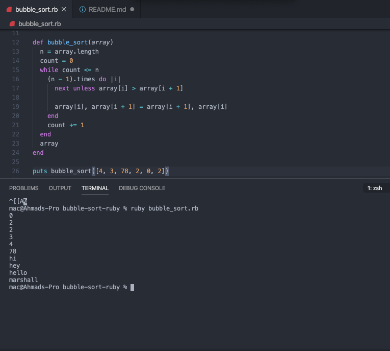

# Bubble sort using Ruby

> This is a bubble sort method that takes an array, loops through it and returns a sorted array after comparing the adjacent elements in the array and swapping if the left is greater than the right.

# Here's an illustration of the bubble sort algorithm

## Built With

- Ruby

## Live Demo

[Live Demo Link](https://repl.it/@ahmadchata/Bubble-sort#main.rb)

## Authors

👤 **Ahmad Chata**

- Github: [@ahmadchata](https://github.com/ahmadchata)
- Twitter: [@ahmadchata](https://twitter.com/ahmadchata)
- Linkedin: [Ahmad Chata](https://www.linkedin.com/in/ahmad-chata-957b9b51/)

👤 **Marshall AKPAN**

- Github: [@uimarshall](https://github.com/uimarshall)
- Twitter: [@uimarshall](https://twitter.com/uimarshall)
- Linkedin: [Marshall Akpan](https://www.linkedin.com/in/marshall-akpan-19745526/)

## 🤝 Contributing

Contributions, issues and feature requests are welcome! Start by:

- Forking the project
- Cloning the project to your local machine
- `cd` into the bubble_sort directory
- Run `git checkout -b your-branch-name`
- Make your contributions
- Push your branch up to your forked repository
- Open a Pull Request with a detailed description to the development branch of the original project for a review

## Show Support

- Give a ⭐ if you like this project.

## Acknowledgements

- Hat tip to Odin Project.
- Microverse.

## 📝 License

This project is [MIT](https://opensource.org/licenses/MIT) licensed.